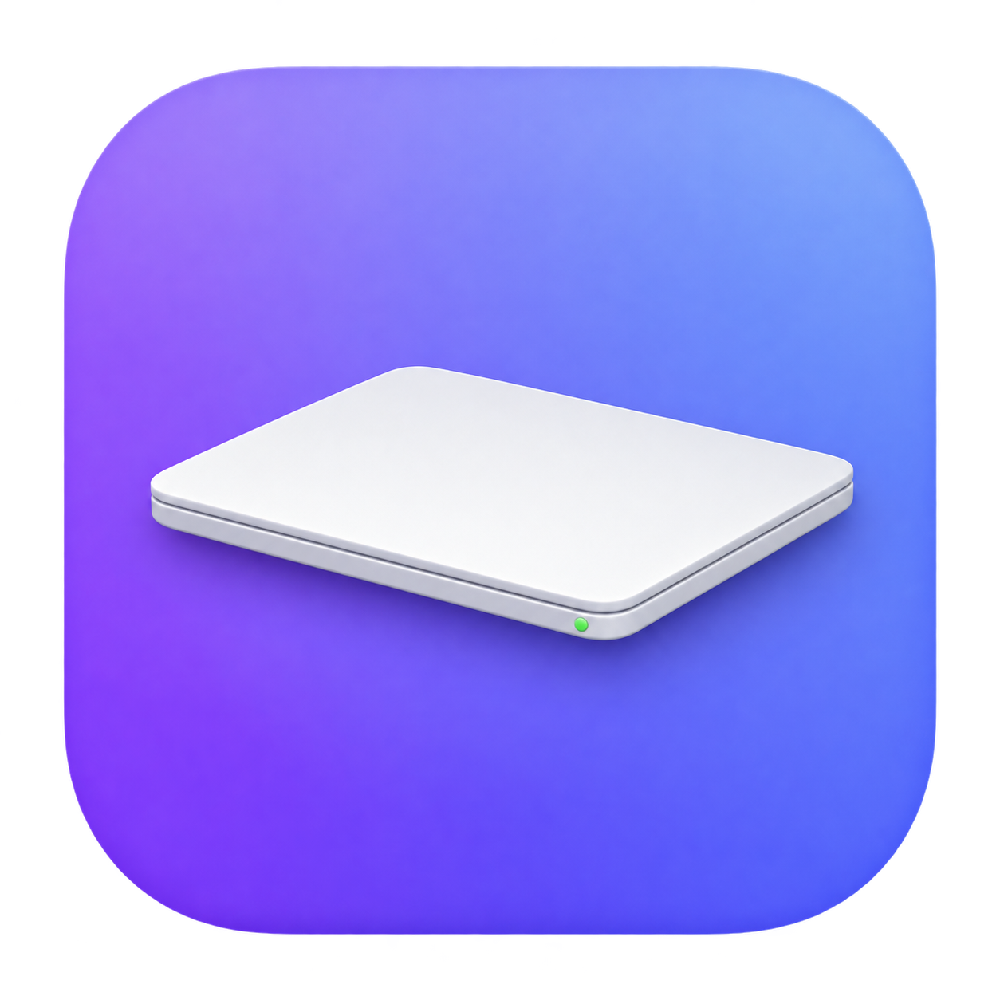

# 合盖继续运行 · LidRun



基于 SwiftUI / AppKit 的原生 macOS 菜单栏工具，合盖后请求熄屏，让本机任务继续执行。当前版本为 2.1.1，包含实时监控、合盖历史报告和原生交互。支持接电和使用电池，记住上次选择的时长和模式；第一次打开默认 1 小时，不会自动禁用睡眠。

需要 macOS 13 或更新版本，以及 Xcode Command Line Tools 或 Xcode 提供的 Swift 编译器和 macOS SDK。当前功能在 Apple Silicon Mac 上验证；部分温度、功率接口依赖机型与系统版本。

## 原生交互

菜单栏左键打开窗口，右键或 Control 点击打开原生菜单。窗口会记住大小与位置；关闭窗口仍在后台记录，最小化、隐藏或完全遮挡后降低采样频率，重新可见时刷新。重新打开软件或点击菜单栏可恢复窗口。

2.1.1 扩大左侧导航按钮的点击区域，整行均可单击；macOS 15 及更新系统中，未激活窗口的第一次轻点即可切换页面。此行为仅用于页面导航。

| 快捷键 | 操作 |
| --- | --- |
| ⌘1 / ⌘2 / ⌘3 | 实时监控 / 合盖历史 / 保持运行 |
| ⌘, | 保持运行设置 |
| ⌘R | 刷新监控 |
| ⌘W / ⌘M / ⌘H | 关闭窗口 / 最小化 / 隐藏 |
| ⌘Q | 保存历史、退出并恢复睡眠 |

原生菜单提供“关于”与窗口操作。界面使用系统字体、原生控件、系统颜色，适应明暗外观；指标卡片合并辅助功能内容，按钮有中文朗读标签与选择状态。

## 温度、性能与合盖报告

左侧“实时监控”显示芯片温度、电池温度、系统温度压力、CPU、内存压力、物理接口流量和估算功率。温度、CPU、内存、网络、功率、电量均有最近 30 分钟曲线；鼠标停在曲线上可查看当时读数。

“合盖历史”按每次实际检测到的合盖分开记录。开盖后默认显示本次报告，可在“保持运行”关闭自动显示。报告包括合盖时长与连续采样覆盖时长、应用和重点后台服务、观测存续时长、CPU 时间、下载与上传、CPU 归因能耗、峰值内存、整机能量估算和起止电量，以及各项历史曲线。VPN、ChatGPT、Codex 优先排列；其他后台仅列活动摘要。完整系统进程清单不属于该统计范围。

监控需要 LidRun 菜单栏软件保持打开，关闭窗口仍会记录。退出软件后停止记录并恢复正常睡眠。以前的心跳日志不包含新指标，软件不会补造这些历史数据。

### 测量范围

- **芯片温度**：这台 Mac 实测可读取 IOHID 温度事件，取有效 `tdie` 传感器最大值，不能保证编号对应某个特定 CPU/GPU 核心。私有接口失效时读数留空，独立保护仍使用系统温度压力。
- **CPU 与内存**：系统 CPU 以全机总容量为 100%；应用 CPU 的 100% 表示一个核心。进程 CPU 时间按 Mach timebase 转换；驻留内存包含可归属辅助进程，共享页可能重复。系统内存占用包含可回收缓存，请结合内存压力判断。
- **应用时长**：只累计同一应用实例在相邻、可信的合盖样本中都存在的时长，不等于一直占用 CPU。短暂出现或退出的进程可能漏采。系统睡眠、长停采、重启、时钟跳变、监控重启或实例变化不冒充连续运行。
- **网络**：整机统计 64 位物理 `en*` 接口字节，排除隧道、回环和桥接重复计数，包含局域网通信。应用按可观测网络连接累计差分；连接关闭、计数重置或短连接漏采会减少覆盖。VPN 原应用与隧道服务可能重复统计，因此不能相加作为整机流量。
- **VPN 后台服务**：闪连的界面与 `lightxtremeService` 分开列出，后者显示为“闪连 VPN 后台服务”。原进程元数据接口受限时，通过原生只读 BSD 接口确认运行实例；没有提升权限。CPU、内存、能量等接口仍可能不可读，此时留空。VPN 界面进程流量低，不能代表整个 VPN 没有传输。
- **应用 CPU 能耗**：来自系统 `ri_energy_nj` 的差分，以 Wh 显示，是 CPU 归因估算，不包含 GPU、屏幕等全部硬件，也不会按 CPU 占用率分摊整机耗电。无权限或缺少基线留空；P 核能量是总 CPU 能量的子集，不再次相加。[Apple Recount 说明](https://github.com/apple-oss-distributions/xnu/blob/main/doc/observability/recount.md)。
- **整机能量**：优先积分本机 `PowerTelemetryData.SystemLoad` 直流负载遥测；单位按本机输入电压/电流与电池功率交叉核实，未找到公开稳定合同，标为“估算”。读数约 20–30 秒刷新，不是插座交流电量。该通道不可用时，仅在纯电池供电期间用电池电流 × 电压放电估算；不把插电时电池 0W 当作整机 0W，不叠加两个通道，不跨来源切换区间积分。报告单独显示能量覆盖时长。

首次采样需要建立差分基线，CPU/流量/CPU 能量暂为空；空缺不表示零。曲线在缺口处分段，累计量只覆盖可靠样本。开盖时刻按采样观测，边界之间无法确定的区间保守留作缺口。

ChatGPT 等应用可能包含大量动态辅助进程。新进程缺少基线、进程已退出或无法读取时，应用仍保留已知进程的合计，以 **≥** 标示部分统计；各项分别标记，不把缺少数据当作零。应用覆盖时长表示读到部分有效数据的区间，不代表覆盖了每个辅助进程。内存合计仍可能包含共享页。历史报告会保留这个标记。

### 监控开销与历史保存

采样在后台执行，不阻塞界面；窗口可见时约每 5 秒、合盖时每 10 秒、窗口关闭或最小化时每 30 秒。温度压力较高时降低采样频率；低电量模式下降至至少 60 秒。采样使用单调时钟调度，系统时间调整不会停采。独立防睡眠保护仍每秒检查，不依赖这些统计频率。

每次合盖使用独立本机报告文件，最多 1200 个曲线点；超过后逐步降采样，累计量和峰值仍按所有有效原始样本计算。进行中报告最多每分钟原子保存一次，开合盖与退出时立即保存，异常退出可能丢失末尾未落盘的一分钟，并标注恢复缺口。最多保留 30 天、64 MB，先移除最旧已结束记录。

两项界面轮询允许系统合并定时唤醒；不重复发布未变化的保护状态。网络采样边读取边排空输出，限制 2 MB 和 2 秒，只清理它自己启动的子命令，避免大量进程时阻塞管道。诊断心跳由后台串行队列追加，最多 30 天、16 MB；日扫描一次，容量按缓存即时限制。保护会话期间每 10 秒记录，正常睡眠模式下每 60 秒，合盖状态或会话阶段变化立即记录。退出前等待待写日志完成。

报告位于 `~/Library/Application Support/LidRun/History`，仅本机保存；不记录网址、通信内容、命令行参数或电池序列号，不上传统计数据。监控不改变 VPN、网络设置、应用优先级，也不结束其他应用。

## 使用

1. 打开 `~/Applications/LidRun.app`，也可以点击菜单栏的笔记本图标；在左侧“保持运行”配置防睡眠。
2. 选择时长和电源模式，点击“开启合盖运行”。
3. 在 **macOS 系统授权窗口**中输入管理员密码。本软件不会读取或保存密码。
4. 界面显示“合盖保持运行已开启”后，才能合盖。合盖时，保护进程单独请求显示器休眠；开盖后停止熄屏请求。开启的是系统睡眠开关，因此也会阻止普通睡眠。
5. 点击“结束并恢复睡眠”结束；只关闭设置窗口时，菜单栏软件仍然运行。

设定时长结束、电量降到 20% 或更低、进入系统低电量模式、系统报告较高温度压力、软件退出或崩溃，独立保护进程会恢复原睡眠设置。“仅接电”模式在拔电后也会结束。电脑重启后，后台保护进程会恢复前一会话的设置，不会自动重新开启。

保护进程崩溃后由系统自动重启，继续原会话和原时限。它在禁用睡眠之前持久保存恢复信息，并额外保存独立备份。状态记录损坏或读取失败时，优先恢复正常睡眠；连续熄屏请求失败也会结束会话。不会为了维持运行而忽略这些故障。

保持电脑联网，并让 ChatGPT / Codex 及正在工作的本机进程继续打开。工具只负责防止系统睡眠；不能修复网络断开、应用崩溃或服务端中止。合盖运行时放在通风的桌面上，不要放进包里。

## VPN、ChatGPT 与其他应用

合盖只请求熄屏并保持系统运行。优先保留 VPN 与 ChatGPT；其他应用也默认保留。LidRun 不退出、强制结束或重启用户应用，不断开 VPN，不切换节点，也不修改网络或代理设置。没有按应用名单关闭程序的逻辑。

保护条件或设定时长触发后，软件会恢复原来的系统睡眠设置。电脑随后可能睡眠，网络连接和任务执行可能暂停；软件不会为了省电先关闭 VPN、ChatGPT 或其他用户应用。现有超时清理只针对 LidRun 自己启动的系统命令子进程。

睡眠开关检查会同时读取系统偏好和内核状态。首次读到关闭、不一致或读取失败时，会短暂复核；持续异常才结束会话，并记录两端读值与时间。软件不会自动覆盖真正关闭的开关。界面和心跳日志会显示会话结束原因。

## 第一次验证

开启后，合盖放置 1–2 分钟，再打开。检查正在执行的任务是否继续推进。“诊断日志”会打开 `~/Library/Logs/LidRun`，保护会话期间每 10 秒记录一次时间、合盖状态、系统睡眠开关和会话状态。合盖期间连续的 `lidClosed: true` 记录，可以帮助核实是否保持运行。

日志出现明显时间空档时，请保留日志，让 Codex 进一步检查 `pmset -g log`。`/Library/Application Support/LidRun/state.json` 也记录合盖与熄屏请求状态。编译通过和读回系统开关都不能替代这次真实合盖测试。

连接在线外接显示器时，不会反复调用全局熄屏命令关掉外屏，而是让系统按正常外接合盖方式管理显示器。

## 恢复与卸载

“恢复睡眠”会调用后台工具恢复保存的原值。“更多 → 卸载后台保护进程”先恢复睡眠，再移除后台服务；之后可以将 `~/Applications/LidRun.app` 移到废纸篓。卸载需要系统授权。

如果软件无法打开，可在终端执行以下恢复命令，并输入系统密码：

```sh
sudo /Library/PrivilegedHelperTools/local.lidrun.guard --restore
```

如后台工具也已丢失，系统自带的最后恢复命令为：

```sh
sudo pmset -a disablesleep 0
pmset -g
```

应看到 `SleepDisabled 0`。这里的恢复是重新允许睡眠，电脑是否立即睡眠还取决于其他程序的电源请求和原来的睡眠计时设置。

## 实现与文件

原生 SwiftUI / AppKit 界面通过 macOS 的管理员授权安装 root 拥有的独立保护进程。开启期间调用系统自带的 `pmset -a disablesleep 1`；结束时恢复原值。合盖熄屏使用独立的 `pmset displaysleepnow`，并结合 CoreGraphics 的显示器状态检查。`disablesleep` 存在于 Apple 开源实现中，但未列入本机 `man pmset`，未来 macOS 更新后应再次实测。

`caffeinate` / 普通闲置睡眠断言不能保证合盖后继续工作。`disablesleep` 是全局、持久设置，因此本工具使用独立 watchdog、有限时长、低电量和温度压力监测以及重启恢复。保护判定使用系统压力信号，仪表盘另显示数值温度；软件保护依赖系统正常运行，不能作为硬件过热保护的替代。

没有修改 SIP、安装内核扩展、配置免密码 sudo、创建登录自启的保持唤醒会话或更改屏幕熄灭时长。后台服务会随开机启动，只负责检查和恢复；没有会话时不会主动禁用睡眠。

| 文件 | 用途 |
| --- | --- |
| `App.swift` | 菜单栏、设置界面、授权、可随 UI 退出的会话进程 |
| `Guard.swift` | 后台会话、超时与安全条件、原设置恢复 |
| `Dashboard.swift` | 实时图表、合盖报告、轻量采样调度与睡眠通知 |
| `Telemetry.swift` / `Metrics.swift` | 只读采样、单位转换与差分数据模型 |
| `PhysicalNetwork.swift` | 64 位物理网络接口字节 |
| `History.swift` | 合盖聚合、覆盖与缺口、原子保存和容量限制 |
| `Diagnostics.swift` | 后台串行心跳日志、退出落盘和日志保留上限 |
| `build.sh` | 编译及本机临时签名 |
| `/Library/PrivilegedHelperTools/local.lidrun.guard` | 第一次开启时安装的 root 后台程序 |
| `/Library/LaunchDaemons/local.lidrun.guard.plist` | 系统后台服务 |
| `/Library/Application Support/LidRun/state.json` | root 写入的会话与原值记录 |
| `/Library/Application Support/LidRun/baseline.json` | 独立保存的会话恢复备份 |
| `~/Library/Logs/LidRun` | 本机合盖验证日志 |
| `~/Library/Application Support/LidRun/History` | 合盖统计报告与曲线 |

构建：

```sh
git clone https://github.com/yiyuxi123/LidRun.git
cd LidRun
zsh build.sh
```

默认直接构建到 `~/Applications/LidRun.app`，不会另外留下可启动的测试副本。构建前请退出该软件；脚本会拒绝覆盖正在运行的应用。

图标由内置 ImageGen 生成，最终资源位于 `assets/LidRun.png` 和 `assets/LidRun.icns`，完整提示词在 `assets/icon-prompt.txt`。`make-icon.sh` 使用 macOS 自带的 `sips` 和 `iconutil` 打包所有图标尺寸。应用程序图标与设置窗口标志使用同一张图。

这是本地构建、临时签名的软件，未进行 Apple 公证。除 Apple 开发工具外，无需安装第三方开发依赖。

## 本机验证记录（2026-10-02）

- 2.1.1 已安装到 `~/Applications/LidRun.app`；菜单栏、实时六项指标、曲线、合盖历史入口与原有设置已检查。升级保留已选时长、电源模式及手动关闭状态。
- 2.1.1 编译与严格签名验证通过。实际分别单击左侧三个按钮文字右方的空白区域，每次单击均完成页面切换；原有设置保持不变。触控板轻点系统设置原本已启用，本次未修改。
- 2.1 已通过完整编译、无警告类型检查、严格签名检查和下述自检。实际界面验证了 ⌘1/2/3 切换、⌘R 刷新与原生窗口菜单；⌘W 关闭窗口后原进程继续运行，⌘Q 正常退出，重新打开恢复仪表盘与相同窗口位置、尺寸。
- 2.1 的 45 项采样、50 项历史、5 项曲线和 14 项诊断日志自检通过，加上 43 项保护自检，共 157 项。历史 actor 的 5 项隔离持久化集成检查也通过。覆盖未知值、部分进程、计数重置、应用实例变化、VPN 服务元数据回退、睡眠缺口、能量来源隔离、旧 JSON、保存限制、独立曲线断点、大管道输出与日志限制。
- 真实只读采样取得芯片/电池温度、整机功率及可读应用的 CPU、收发、CPU 归因能量；完整采样含聚合约 0.2 秒。界面独立显示 VPN 后台服务和实际传输数据的核心进程；系统拒绝读取的 CPU、内存显示为未知。未更改网络或睡眠开关，VPN 主程序、后台服务和 ChatGPT 原进程持续运行。新合盖报告仍需下一次实际合盖产生，历史自检不是硬件合盖实测。
- Swift 编译、应用签名验证、后台服务 plist 检查通过。
- 后台工具 43 项自检通过，覆盖电量、温度压力、低电量模式、期限、重启、会话身份、合盖请求限频、旧记录兼容，以及瞬态和持续睡眠状态异常的复核。
- 界面退出和界面进程被强制终止时，会话进程都能因管道关闭而退出。
- 开启后，系统配置与内核的 `SleepDisabled` 都读回为开启。
- 实际强制终止一次运行中的保护进程，系统将它重启；会话身份、所有者、原值和结束时间保持不变。
- 合盖熄屏的真实硬件效果由合盖后的显示状态记录和实际使用共同确认；自检不代替实测。

参考依据：[Apple pmset 源码](https://github.com/apple-oss-distributions/PowerManagement/blob/main/pmset/pmset.m#L5419-L5439)、[Apple 熄屏命令实现](https://github.com/apple-oss-distributions/PowerManagement/blob/main/pmset/pmset.m#L911-L935)、[Apple 内核睡眠检查](https://github.com/apple-oss-distributions/xnu/blob/main/iokit/Kernel/IOPMrootDomain.cpp#L7099-L7155)、[Apple 闲置睡眠 API](https://developer.apple.com/documentation/iokit/kiopmassertiontypepreventuseridlesystemsleep)。
